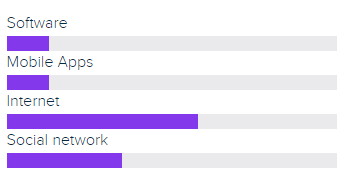

# User demographics

The users of the MindSpaces reservation system come from a variety of industries and sectors, including healthcare, education, technology, and finance. Within these industries, users may include employees from different departments, teams, or external parties who need to reserve meeting rooms, workspaces, or other spaces for their activities.

## Level of IT
One important demographic factor to consider is the level of IT experience of the users. Many users of MindSpaces may not have significant experience with IT systems, and therefore may require a system that is easy to use and navigate. The reservation system should be designed to be accessible to users of all levels of IT proficiency, ensuring that all users are able to reserve spaces efficiently.

## Location
Another demographic factor to consider is the location of the users. While MindSpaces can be used by organizations located anywhere in the world, the system may need to be tailored to specific regions or countries. For example, users in certain regions may have specific language requirements or cultural expectations when it comes to the reservation process. In the first phase it will be developed for users based in the Netherlands. The language that will be used in the application will be Dutch as main language and English as second option. 

## Roles

Additionally, the users of MindSpaces may have different roles within their organizations, with varying levels of access and permissions within the system. The reservation system should be designed to accommodate these different roles, providing different levels of access and permissions as needed.

Overall, the users of the MindSpaces reservation system may come from a variety of industries, locations, and roles within their organizations. The system should be designed to be accessible and usable for all users, regardless of their background, IT proficiency, or location, and should be tailored to specific user needs as necessary.