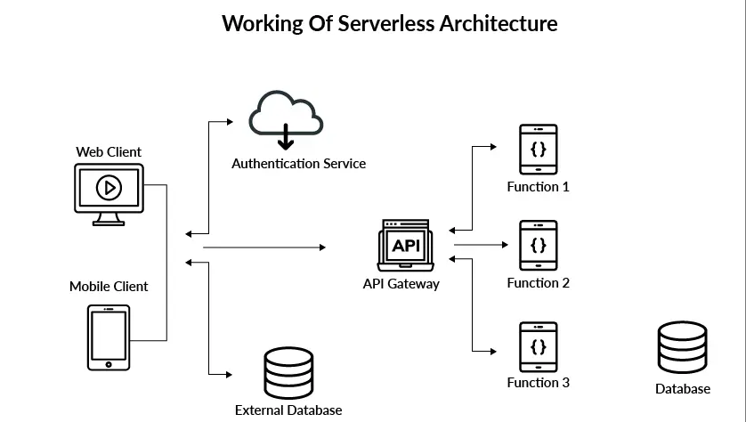

# Serverless Architecture

A serverless architecture is a way to build and run applications and services without having to manage infrastructure. Your application still runs on servers, but all the server management is done by AWS or another cloud service. You no longer have to provision, scale, and maintain servers to run your applications, databases, and storage systems. 

## Architecture

First I will  define how I think serverless works.

### How Serverless Architecture Works

Servers facilitate communication between users and applications, allowing access to business logic. However, server management requires significant time and resources. Teams are responsible for maintaining server hardware, software and security updates, and creating backups in case of system failures. By embracing serverless architecture, developers can delegate these responsibilities to third-party providers, allowing them to focus on writing application code.

One of the most widely-used serverless architectures is Function as a Service (FaaS), in which developers write application code as discrete functions. Each function performs a specific task when triggered by an event, such as an incoming email or an HTTP request. After testing, developers deploy their functions and triggers to a cloud provider account. When a function is invoked, the cloud provider executes it on a running server, or spins up a new server for execution if none are running. This execution process is abstracted from developers' view, who can concentrate on writing and deploying the application code. Function as a Service (FaaS) is a popular type of serverless architecture that enables developers to focus on application code.

Although serverless architecture has been available for more than a decade, Amazon introduced the first mainstream FaaS platform, AWS Lambda, in 2014. Currently, the majority of developers use AWS Lambda to build serverless applications. Nevertheless, Google and Microsoft also offer their own FaaS platforms, called Google Cloud Functions (GCF) and Azure Functions, respectively.
### Fundamental Concepts in Serverless Architecture

Despite eliminating the need for server management, serverless architecture has a steep learning curve, particularly when chaining multiple functions together to create complex workflows in an application. To ease this process, it is beneficial to acquaint oneself with the following fundamental serverless terms:
- **Invocation**: A single function execution.

- **Duration**: The time it takes for a serverless function to execute.

- **Cold Start**: The latency that occurs when a function is triggered for the first time or after a period of inactivity.

- **Concurrency Limit**: The number of function instances that can run simultaneously in one region, as determined by the cloud provider. A function will be throttled if it exceeds this limit.

- **Timeout**: The amount of time that a cloud provider allows a function to run before terminating it. Most providers set a default timeout and a maximum timeout.

Keep in mind that each cloud provider may use different terminology and set unique limits on serverless functions, but the list above defines the basic concepts.

## Advantages

In recent years, there has been a notable surge in serverless adoption, with almost 40 percent of companies worldwide utilizing it in some capacity. Both small startups and global corporations are leveraging serverless architectures for the following reasons:
- **Cost**: Cloud providers charge you on a per-invocation basis, so you’re not paying for unused servers or virtual machines.

- **Scalability**: Function instances are automatically created or removed in response to traffic variations, within the boundaries of concurrency limits.

- **Productivity**: Engineers who use serverless can simply deploy their code without having to manage any servers, which helps accelerate delivery cycles and rapidly scale company operations.
## Disadvantages

- **Loss of Control**: In serverless environments, you lack control over the software stack that your code runs on. If a hardware fault, data center outage, or other issue impacts one of your servers, you’re dependent on a cloud provider to fix it.

- **Security**: A cloud provider may run code from several of their customers on the same server at the same time. If the shared server isn’t configured properly, your application data could be exposed.

- **Performance Impact**: Cold starts are common in serverless environments, adding several seconds of latency to code execution when functions are invoked after a period of inactivity.

- **Testing**: Developers can run unit tests on function code, but integration tests, which evaluate how frontend and backend components interact, are difficult to perform in a serverless environment.

- **Vendor Lock-In**: Large cloud providers like AWS offer several services—such as databases, messaging queues, and APIs—that you can use in harmony to run serverless applications. Although it’s possible to mix and match elements from different vendors, services from a single provider are designed to integrate most seamlessly.
## Conclusion
In this section, I have presented an overview of serverless architecture and evaluated its pros and cons. Now, I would like to elaborate on why I believe this architecture aligns well with MindSpaces.

MindSpaces is well-suited for serverless architecture as it enables us to develop a lightweight application that can be effortlessly maintained. With rapid iteration cycles, we can quickly adjust and improve the application. Additionally, I believe that alternative architectures, such as microservices, may be overly complex for this project.

Although MindSpaces may benefit from serverless architecture, the college requirements mandate the use of a microservices architecture. Therefore, we will leverage the advantages of microservices while ensuring that the architecture remains manageable and adaptable for the needs of our project.